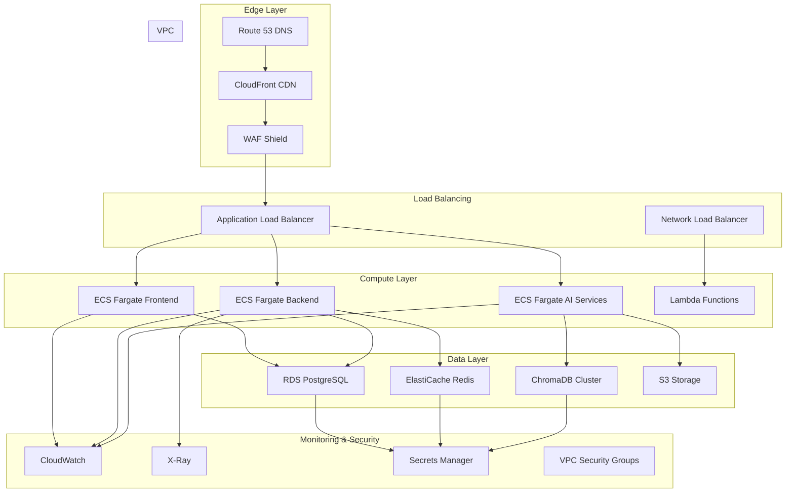

# SmartSelf AI - Intelligent Self-Improvement Platform

[](https://opensource.org/licenses/MIT)
[](https://www.python.org/downloads/)
[](https://fastapi.tiangolo.com/)
[](https://reactjs.org/)
[](https://www.docker.com/)
[](https://github.com/your-org/smartself-ai)

## Product Overview

**SmartSelf AI** is a production-grade intelligent self-improvement platform that leverages advanced AI technologies to provide personalized coaching, habit tracking, and cognitive enhancement tools. The platform combines conversational AI, data analytics, and behavioral science to deliver actionable insights for personal and professional growth.

Built with enterprise-grade architecture, SmartSelf AI serves individuals, teams, and organizations seeking measurable performance improvement through AI-driven personal development.

## Core Features

### Personal Development
- **AI-Powered Coaching**: 24/7 conversational coaching with context-aware responses
- **Habit Tracking**: Intelligent habit formation with predictive analytics
- **Goal Management**: SMART goal setting with progress tracking and milestone celebrations
- **Performance Analytics**: Comprehensive dashboards showing growth metrics and trends

### Cognitive Enhancement
- **Memory Palace**: Spaced repetition learning with AI-optimized scheduling
- **Skill Assessment**: AI-driven skill gap analysis and personalized learning paths
- **Productivity Insights**: Time tracking and focus optimization recommendations
- **Mental Wellness**: Sentiment analysis and stress management tools

### Team & Enterprise
- **Team Analytics**: Aggregate performance metrics and team dynamics insights
- **Collaborative Goals**: Shared objectives with progress synchronization
- **Leadership Dashboard**: Management tools for team development tracking
- **API Integration**: Seamless integration with existing enterprise systems

### AI Features
- **Conversational Intelligence**: Natural language understanding with contextual memory
- **Predictive Analytics**: Machine learning models for behavior prediction and optimization
- **Personalized Recommendations**: AI-driven suggestions based on user patterns and goals
- **Adaptive Learning**: Continuous improvement of coaching strategies through user feedback

## System Architecture


## Chat Flow Architecture


## Database Management Architecture


## Vector DB / RAG Pipeline


## Deployment Architecture



## Technology Stack

### Frontend Technologies
| Technology | Purpose | Rationale |
|------------|---------|-----------|
| **React 18.2** | UI Framework | Component-based architecture with concurrent features, excellent ecosystem, and hooks-based state management |
| **TypeScript** | Type Safety | Compile-time error detection, enhanced IDE support, and scalable codebase maintenance |
| **TailwindCSS** | Styling System | Utility-first CSS framework enabling rapid UI development with consistent design patterns |
| **Zustand** | State Management | Lightweight state management solution with minimal boilerplate and excellent performance |
| **Recharts** | Data Visualization | Declarative charting library with React integration and responsive design capabilities |
| **Socket.io** | Real-time Communication | WebSocket-based real-time updates with fallback mechanisms and event-driven architecture |

### Backend Technologies
| Technology | Purpose | Rationale |
|------------|---------|-----------|
| **FastAPI** | API Framework | High-performance async framework with automatic OpenAPI documentation and type hints |
| **Pydantic** | Data Validation | Runtime type checking and data validation with seamless OpenAPI integration |
| **SQLAlchemy** | ORM | Database abstraction layer with migration support and relationship management |
| **Uvicorn** | ASGI Server | High-performance async server with WebSocket support and HTTP/2 capabilities |
| **Alembic** | Database Migrations | Version control for database schema with rollback capabilities |

### AI/ML Technologies
| Technology | Purpose | Rationale |
|------------|---------|-----------|
| **OpenAI API** | LLM Integration | State-of-the-art language models for reasoning and natural language understanding |
| **ChromaDB** | Vector Database | Local deployment capability with efficient semantic search and similarity matching |
| **Sentence Transformers** | Embeddings | Open-source embedding models with multilingual support and no API dependencies |
| **scikit-learn** | Classical ML | Comprehensive machine learning library for preprocessing and traditional ML algorithms |
| **pandas/numpy** | Data Processing | Industry-standard libraries for data manipulation and numerical computing |

### Infrastructure Technologies
| Technology | Purpose | Rationale |
|------------|---------|-----------|
| **Docker** | Containerization | Consistent deployment environments and microservices architecture support |
| **AWS ECS Fargate** | Container Orchestration | Serverless container execution with automatic scaling and patch management |
| **PostgreSQL** | Primary Database | ACID compliance, complex query support, and proven scalability |
| **Redis** | Caching Layer | In-memory data structure store for high-performance caching and session management |
| **S3** | Object Storage | Scalable object storage with durability guarantees and lifecycle management |

## Installation & Environment Setup

### Prerequisites
- **Python 3.11+**
- **Node.js 18+**
- **Docker & Docker Compose**
- **AWS CLI** (for deployment)
- **PostgreSQL 15+** (local development)

### Environment Variables

| Variable | Description | Required | Default |
|----------|-------------|----------|---------|
| `DATABASE_URL` | PostgreSQL connection string | Yes | - |
| `REDIS_URL` | Redis connection string | Yes | - |
| `OPENAI_API_KEY` | OpenAI API key | Yes | - |
| `JWT_SECRET_KEY` | JWT signing secret | Yes | - |
| `ENVIRONMENT` | Deployment environment | No | `development` |
| `LOG_LEVEL` | Logging verbosity | No | `INFO` |
| `CORS_ORIGINS` | Allowed CORS origins | No | `http://localhost:3000` |
| `CHROMA_PERSIST_DIRECTORY` | Vector DB storage path | No | `./data/chroma` |
| `MAX_CONVERSATION_LENGTH` | Max conversation history | No | `50` |
| `EMBEDDING_MODEL` | Sentence transformer model | No | `all-MiniLM-L6-v2` |

### Quick Start

```bash
# Clone repository
git clone https://github.com/your-org/smartself-ai.git
cd smartself-ai

# Set up environment
cp .env.example .env
# Edit .env with your configuration

# Start infrastructure services
docker-compose up -d postgres redis chromadb

# Install backend dependencies
python -m venv venv
source venv/bin/activate  # Windows: venv\Scripts\activate
pip install -r requirements.txt

# Run database migrations
alembic upgrade head

# Install frontend dependencies
cd frontend
npm install
npm run build

# Start development servers
cd ..
uvicorn copilot_chatbot.main:app --reload --host 0.0.0.0 --port 8000 &
cd frontend && npm run dev
```

## Running Locally

### Development Commands

```bash
# Backend development server
uvicorn copilot_chatbot.main:app --reload --host 0.0.0.0 --port 8000

# Frontend development server
cd frontend && npm run dev

# Database operations
alembic revision --autogenerate -m "Add new feature"
alembic upgrade head

# Testing
pytest tests/ -v --cov=.
pytest tests/integration/ -v
pytest tests/e2e/ -v

# Code quality
black copilot_chatbot/
flake8 copilot_chatbot/
mypy copilot_chatbot/

# Docker development
docker-compose -f docker-compose.dev.yml up
```

### Production Build

```bash
# Build production Docker images
docker build -f Dockerfile.prod -t smartself-ai:latest .

# Run production stack
docker-compose -f docker-compose.prod.yml up -d

# Health checks
curl http://localhost:8000/health
curl http://localhost:3000
```

## API Documentation

### Authentication Endpoints

#### POST /api/auth/register
```json
// Request
{
  "email": "user@example.com",
  "username": "johndoe",
  "password": "securepassword123",
  "profile": {
    "first_name": "John",
    "last_name": "Doe",
    "timezone": "UTC-5"
  }
}

// Response
{
  "access_token": "eyJ0eXAiOiJKV1QiLCJhbGciOiJIUzI1NiJ9...",
  "refresh_token": "eyJ0eXAiOiJKV1QiLCJhbGciOiJIUzI1NiJ9...",
  "user": {
    "id": "uuid",
    "email": "user@example.com",
    "username": "johndoe"
  }
}
```

#### POST /api/auth/login
```json
// Request
{
  "email": "user@example.com",
  "password": "securepassword123"
}

// Response
{
  "access_token": "eyJ0eXAiOiJKV1QiLCJhbGciOiJIUzI1NiJ9...",
  "refresh_token": "eyJ0eXAiOiJKV1QiLCJhbGciOiJIUzI1NiJ9...",
  "user": {
    "id": "uuid",
    "email": "user@example.com",
    "username": "johndoe"
  }
}
```

### Chat Endpoints

#### POST /api/chat/message
```json
// Request
{
  "message": "How can I improve my productivity?",
  "context": {
    "session_id": "uuid",
    "goal_context": ["productivity", "time management"]
  }
}

// Response
{
  "id": "uuid",
  "message": "Based on your recent activity patterns...",
  "suggestions": [
    "Try the Pomodoro technique",
    "Review your time tracking data"
  ],
  "metadata": {
    "response_time_ms": 1250,
    "context_used": true,
    "confidence_score": 0.89
  }
}
```

#### GET /api/chat/history
```json
// Query Parameters
// ?session_id=uuid&limit=20&offset=0

// Response
{
  "conversations": [
    {
      "id": "uuid",
      "messages": [
        {
          "role": "user",
          "content": "How can I improve my productivity?",
          "timestamp": "2024-01-15T10:30:00Z"
        },
        {
          "role": "assistant",
          "content": "Based on your recent activity patterns...",
          "timestamp": "2024-01-15T10:30:02Z"
        }
      ],
      "session_id": "uuid",
      "created_at": "2024-01-15T10:30:00Z"
    }
  ],
  "total": 45,
  "has_more": true
}
```

### Goals Endpoints

#### POST /api/goals
```json
// Request
{
  "title": "Learn Python Programming",
  "description": "Master Python development fundamentals",
  "category": "skill_development",
  "target_date": "2024-06-30",
  "milestones": [
    {
      "title": "Complete Python basics",
      "target_date": "2024-02-28",
      "criteria": "Finish online course modules 1-5"
    }
  ]
}

// Response
{
  "id": "uuid",
  "title": "Learn Python Programming",
  "status": "active",
  "progress": 0.15,
  "created_at": "2024-01-15T10:30:00Z",
  "milestones": [...]
}
```

## Security Considerations

### Authentication & Authorization
- **JWT-based Authentication**: Stateless authentication with refresh token rotation
- **Role-Based Access Control**: Granular permissions for different user roles
- **API Rate Limiting**: Prevent abuse with configurable rate limits per endpoint
- **Session Management**: Secure session handling with automatic expiration

### Data Protection
- **Encryption at Rest**: AES-256 encryption for sensitive data in PostgreSQL
- **Encryption in Transit**: TLS 1.3 for all API communications
- **PII Data Masking**: Automatic masking of personally identifiable information
- **GDPR Compliance**: Data portability and right-to-be-forgotten implementations

### Infrastructure Security
- **VPC Isolation**: Network segmentation with private subnets for databases
- **Security Groups**: Fine-grained network access controls
- **WAF Protection**: AWS WAF rules for common attack patterns
- **Secrets Management**: AWS Secrets Manager for sensitive configuration
- **Audit Logging**: Comprehensive audit trails for all administrative actions

## Performance Optimization

### Database Optimization
- **Connection Pooling**: PgBouncer for efficient database connection management
- **Query Optimization**: Indexed queries with EXPLAIN ANALYZE monitoring
- **Read Replicas**: Read scaling for analytics queries
- **Caching Strategy**: Redis caching for frequently accessed data

### Application Performance
- **Async Processing**: Non-blocking I/O operations throughout the stack
- **CDN Distribution**: CloudFront for static asset delivery
- **Image Optimization**: Automatic image compression and format conversion
- **Bundle Splitting**: Code splitting for reduced initial load times

### AI/ML Optimization
- **Model Caching**: In-memory caching of loaded models
- **Batch Processing**: Vector operations in batches for efficiency
- **Quantization**: Model quantization for reduced memory usage
- **Edge Computing**: Lambda@Edge for simple AI operations

## Scaling Strategy

### Horizontal Scaling
- **Auto Scaling Groups**: ECS service auto-scaling based on CPU/memory metrics
- **Load Balancing**: Application Load Balancer with health checks
- **Database Sharding**: Horizontal partitioning for large datasets
- **Microservices**: Service decomposition for independent scaling

### Vertical Scaling
- **Instance Optimization**: Right-sized instances based on workload patterns
- **Memory Management**: Efficient memory usage patterns and garbage collection
- **Storage Scaling**: EBS volume scaling with performance optimization

### Cost Optimization
- **Spot Instances**: Cost-effective compute for batch processing
- **Reserved Instances**: Discounted capacity for baseline workloads
- **Auto-scaling Policies**: Dynamic scaling based on demand patterns
- **Resource Tagging**: Comprehensive cost allocation and monitoring

## Future Implementation

### Vision Architecture


### Implementation Phases

#### Phase 1: Mobile Expansion & Advanced Analytics
- **Mobile Applications**: Native iOS and Android apps with offline capabilities
- **Advanced Analytics**: Real-time performance metrics and predictive insights
- **Time Series Database**: InfluxDB for high-performance analytics storage
- **Real-time Dashboards**: WebSocket-based live data visualization

#### Phase 2: Enterprise Features & Voice Interface
- **Multi-tenant Architecture**: Scalable SaaS platform with tenant isolation
- **Voice Interface**: Natural language voice commands and responses
- **Enterprise SSO**: SAML/OAuth integration for corporate environments
- **Microservices**: Service decomposition for independent scaling

#### Phase 3: AI Evolution & Global Scale
- **Personalized ML Models**: User-specific machine learning models
- **Edge AI Processing**: Local AI inference for reduced latency
- **Blockchain Achievements**: Verifiable achievement tracking
- **Global CDN**: Worldwide content distribution for low-latency access

## Contributing Guide

### Development Workflow
1. **Fork** the repository and create a feature branch
2. **Set up** development environment following installation guide
3. **Make changes** with comprehensive tests
4. **Ensure code quality** with linting and formatting
5. **Submit pull request** with detailed description
6. **Code review** and automated testing
7. **Merge** to main branch

### Code Standards
- **Python**: Follow PEP 8, use type hints, comprehensive docstrings
- **TypeScript**: Strict mode enabled, proper interface definitions
- **Testing**: Minimum 80% coverage, integration tests for APIs
- **Documentation**: Update API docs for all endpoint changes
- **Commits**: Conventional commit format (`feat:`, `fix:`, `docs:`, etc.)

### Development Commands
```bash
# Setup development environment
make dev-setup

# Run all tests
make test-all

# Code quality checks
make lint
make format
make type-check

# Build documentation
make docs-build
```

## License

This project is licensed under the MIT License - see the [LICENSE](LICENSE) file for details.

## Support

- **Documentation**: [docs.smartself.ai](https://docs.smartself.ai)
- **API Reference**: [api.smartself.ai/docs](https://api.smartself.ai/docs)
- **Issues**: [GitHub Issues](https://github.com/your-org/smartself-ai/issues)
- **Discussions**: [GitHub Discussions](https://github.com/your-org/smartself-ai/discussions)
- **Community**: [Discord Server](https://discord.gg/smartself)
- **Enterprise**: enterprise@smartself.ai

---

**Built with precision for intelligent personal development**  
**Deploy globally in minutes, scale infinitely**

*Last updated: February 2026*
