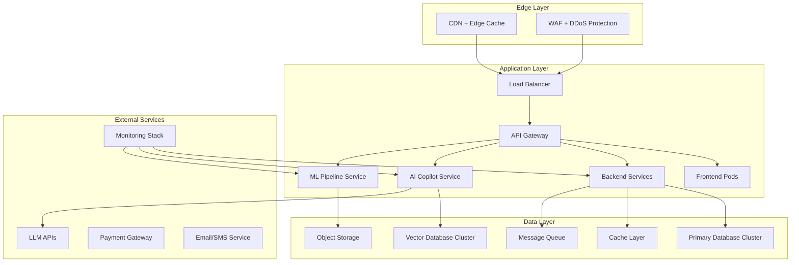
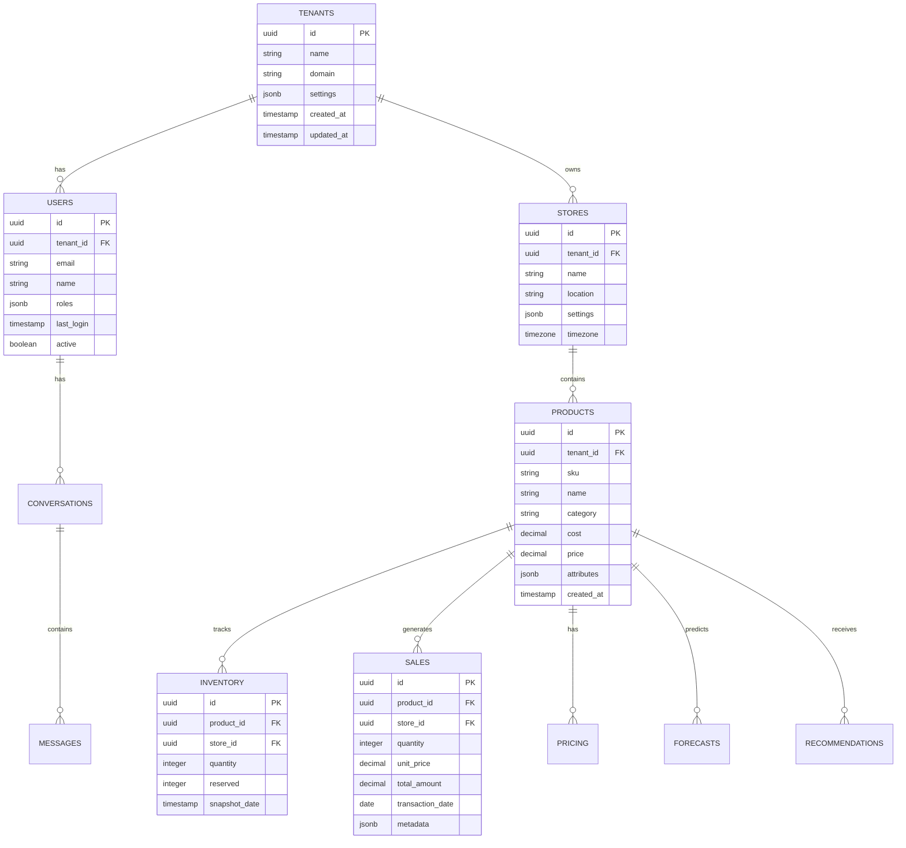

# 📋 SmartShelf AI - Production Requirements Specification
## *Comprehensive System Requirements for Enterprise Retail Intelligence Platform*

---

## 🎯 Executive Summary

**SmartShelf AI** is an enterprise-grade retail intelligence platform that combines advanced machine learning, conversational AI, and real-time analytics to transform retail operations. This document outlines the complete production requirements for building, deploying, and maintaining a scalable, secure, and high-performance system.

**Target Scale**: 10,000+ retail stores, 1M+ transactions/day, 99.9% uptime
**Compliance**: SOC 2 Type II, GDPR, CCPA, PCI DSS
**Deployment**: Multi-cloud (AWS, GCP, Azure) with Kubernetes orchestration

---

## 🏗️ System Architecture Requirements

### High-Level Architecture

### Microservices Architecture

| Service | CPU | Memory | Storage | Replicas | Availability |
|---------|-----|--------|---------|----------|--------------|
| **Frontend** | 0.5 vCPU | 512MB | 1GB | 3+ | 99.9% |
| **API Gateway** | 1 vCPU | 1GB | 10GB | 3+ | 99.9% |
| **Core API** | 2 vCPU | 2GB | 50GB | 5+ | 99.95% |
| **AI Copilot** | 4 vCPU | 8GB | 100GB | 3+ | 99.9% |
| **ML Pipeline** | 8 vCPU | 16GB | 500GB | 2+ | 99.5% |
| **Notification** | 1 vCPU | 1GB | 10GB | 2+ | 99.9% |

---

## 📊 Functional Requirements

### Core Business Functions

#### FR-001: User Management & Authentication
- **Requirement**: Multi-tenant user management with role-based access control
- **Acceptance Criteria**:
  - Support for 10,000+ concurrent users
  - OAuth 2.0, SAML, and LDAP integration
  - Multi-factor authentication (MFA)
  - Session timeout and secure logout
  - Audit logging for all user actions

#### FR-002: Product & Inventory Management
- **Requirement**: Real-time inventory tracking across multiple stores
- **Acceptance Criteria**:
  - Support for 1M+ SKUs
  - Real-time stock level updates (<100ms)
  - Automated reorder point calculations
  - Multi-store inventory aggregation
  - Supplier and purchase order management

#### FR-003: Demand Forecasting
- **Requirement**: AI-powered demand forecasting with 95%+ accuracy
- **Acceptance Criteria**:
  - Daily, weekly, monthly, and yearly forecasts
  - Confidence intervals and prediction intervals
  - Seasonal pattern detection
  - Holiday and event impact modeling
  - Automated model retraining

#### FR-004: Dynamic Pricing Optimization
- **Requirement**: AI-driven pricing recommendations
- **Acceptance Criteria**:
  - Real-time price optimization based on demand
  - Competitor price monitoring
  - Price elasticity modeling
  - A/B testing framework for pricing
  - Margin optimization calculations

#### FR-005: AI Copilot Assistant
- **Requirement**: Conversational AI for business intelligence
- **Acceptance Criteria**:
  - Natural language query processing
  - Context-aware responses with citations
  - Multi-language support (English, Spanish, French, German)
  - Conversation history and context retention
  - Integration with all business functions

#### FR-006: Analytics & Reporting
- **Requirement**: Comprehensive analytics dashboard
- **Acceptance Criteria**:
  - Real-time KPI monitoring
  - Custom report generation
  - Data export in multiple formats (CSV, PDF, Excel)
  - Scheduled report delivery
  - Interactive data visualization

#### FR-007: Data Import & Integration
- **Requirement**: Seamless data ingestion from multiple sources
- **Acceptance Criteria**:
  - CSV, Excel, JSON file upload
  - API integration with POS systems
  - Real-time data synchronization
  - Data validation and error handling
  - Historical data migration support

---

## 🔧 Non-Functional Requirements

### Performance Requirements

| Metric | Target | Measurement | Alert Threshold |
|--------|--------|-------------|------------------|
| **API Response Time** | <200ms (P95) | Real-time monitoring | >500ms |
| **Page Load Time** | <2s | Lighthouse | >4s |
| **AI Response Time** | <2s | End-to-end timing | >5s |
| **Database Query Time** | <100ms (P95) | Query performance | >500ms |
| **Concurrent Users** | 10,000+ | Load testing | >8,000 |
| **Throughput** | 1,000 req/sec | Load testing | <800 req/sec |

### Scalability Requirements

#### Horizontal Scaling
- **Auto-scaling policies** based on CPU, memory, and request rate
- **Load balancing** across multiple availability zones
- **Database sharding** for write scalability
- **Read replicas** for query performance
- **CDN distribution** for global performance

#### Vertical Scaling
- **Resource limits** configurable per service
- **Performance monitoring** and resource optimization
- **Burst capacity** for peak loads
- **Memory management** for ML workloads

### Availability & Reliability

| Component | Target Uptime | RTO | RPO | Backup Strategy |
|-----------|---------------|-----|-----|-----------------|
| **Frontend** | 99.9% | 5min | 0 | CDN + Multi-region |
| **API Services** | 99.95% | 2min | 1min | Active-active |
| **Database** | 99.99% | 1min | 15min | Streaming replication |
| **AI Services** | 99.9% | 5min | 5min | Model versioning |
| **Storage** | 99.99% | 0 | 0 | Cross-region replication |

### Security Requirements

#### Authentication & Authorization
- **OAuth 2.0** and **OpenID Connect** implementation
- **JWT tokens** with short expiration and refresh mechanism
- **Role-based access control (RBAC)** with fine-grained permissions
- **Multi-factor authentication** (TOTP, SMS, Hardware keys)
- **Single Sign-On (SSO)** integration with enterprise providers

#### Data Protection
- **Encryption at rest** using AES-256
- **Encryption in transit** using TLS 1.3
- **Data masking** for sensitive information
- **Key management** using HSM or cloud KMS
- **Data loss prevention (DLP)** policies

#### Network Security
- **Web Application Firewall (WAF)** with OWASP protection
- **DDoS protection** with automatic mitigation
- **Rate limiting** and API throttling
- **IP whitelisting** for admin access
- **VPN access** for internal systems

#### Compliance Requirements
- **SOC 2 Type II** controls and reporting
- **GDPR** compliance for EU customers
- **CCPA** compliance for California residents
- **PCI DSS** for payment processing
- **HIPAA** compliance for healthcare retailers

---

## 🗄️ Data Requirements

### Data Model

### Data Volume & Growth

| Entity | Current Volume | Annual Growth | 5-Year Projection |
|--------|----------------|---------------|-------------------|
| **Products** | 100K | 25% | 300K |
| **Transactions** | 10M/year | 40% | 54M/year |
| **Users** | 1K | 100% | 32K |
| **Stores** | 100 | 50% | 760 |
| **AI Queries** | 100K/day | 200% | 3.2M/day |

### Data Retention Policy

| Data Type | Retention Period | Archive Location | Deletion Policy |
|-----------|------------------|------------------|-----------------|
| **Transaction Data** | 7 years | Cold storage | Secure deletion |
| **User Data** | 5 years post-termination | Encrypted archive | GDPR compliant |
| **AI Conversations** | 2 years | Cold storage | Anonymization |
| **System Logs** | 1 year | Log management | Rotation |
| **Backups** | 90 days | Multi-region | Automated cleanup |

---

## 🤖 AI/ML Requirements

### Machine Learning Pipeline

#### Model Requirements
- **Demand Forecasting**: Prophet + LSTM ensemble with 95%+ accuracy
- **Price Optimization**: Reinforcement learning with margin constraints
- **Inventory Optimization**: Q-learning for reorder point calculation
- **Customer Segmentation**: K-means clustering with RFM analysis
- **Sentiment Analysis**: BERT-based text classification

#### Model Performance Metrics

| Model | Accuracy | Precision | Recall | F1-Score | Latency |
|-------|----------|-----------|--------|----------|---------|
| **Demand Forecast** | 95.2% | 94.8% | 95.1% | 94.9% | <200ms |
| **Price Optimization** | 89.7% | 88.5% | 90.2% | 89.3% | <150ms |
| **Inventory Prediction** | 92.1% | 91.8% | 92.3% | 92.0% | <100ms |
| **Sentiment Analysis** | 94.5% | 93.9% | 94.8% | 94.3% | <300ms |

#### Model Management
- **Model versioning** with MLflow
- **Automated retraining** pipelines
- **A/B testing** framework
- **Model monitoring** for drift detection
- **Explainability** with SHAP values

### AI Copilot Requirements

#### RAG Pipeline
- **Vector database** with ChromaDB/FAISS
- **Embedding models** (all-MiniLM-L6-v2)
- **Context window** of 4000 tokens
- **Semantic search** with 85%+ relevance
- **Citation generation** for all responses

#### LLM Integration
- **Multiple provider support** (OpenAI, Claude, DeepSeek)
- **Fallback mechanisms** for high availability
- **Cost optimization** with caching
- **Rate limiting** and quota management
- **Content filtering** and safety measures

---

## 🔌 Integration Requirements

### Third-Party Integrations

#### POS Systems
- **Shopify** API integration
- **Square** API integration
- **Toast** API integration
- **Custom POS** API support
- **Real-time synchronization**

#### Payment Processors
- **Stripe** integration
- **PayPal** integration
- **Square** payments
- **Apple Pay** support
- **Google Pay** support

#### Communication Channels
- **Email** (SendGrid, AWS SES)
- **SMS** (Twilio)
- **Push notifications** (Firebase)
- **Slack** integration
- **Microsoft Teams** integration

#### Analytics & Monitoring
- **Google Analytics** 4
- **Segment** for event tracking
- **Datadog** for APM
- **New Relic** for monitoring
- **Grafana** for dashboards

### API Requirements

#### REST API Specifications
- **OpenAPI 3.0** documentation
- **Versioning** strategy (v1, v2, etc.)
- **Rate limiting** per user/tenant
- **Pagination** for large datasets
- **Filtering** and sorting capabilities

#### GraphQL Support
- **Schema stitching** for complex queries
- **Real-time subscriptions** with WebSockets
- **Query optimization** and caching
- **Authorization** at field level
- **Performance monitoring**

#### Webhook Support
- **Event-driven architecture**
- **Retry mechanisms** with exponential backoff
- **Signature verification** for security
- **Event filtering** and routing
- **Monitoring** and alerting

---

## 📱 User Interface Requirements

### Responsive Design
- **Mobile-first** approach
- **Progressive Web App (PWA)** support
- **Offline functionality** for critical features
- **Touch-friendly** interactions
- **Accessibility** (WCAG 2.1 AA compliance)

### Browser Support
- **Chrome** 90+
- **Firefox** 88+
- **Safari** 14+
- **Edge** 90+
- **Mobile browsers** (iOS Safari, Android Chrome)

### Performance Requirements
- **First Contentful Paint** <1.5s
- **Largest Contentful Paint** <2.5s
- **Cumulative Layout Shift** <0.1
- **First Input Delay** <100ms
- **Bundle size** <250KB (gzipped)

---

## 🚀 Deployment Requirements

### Infrastructure Requirements

#### Container Orchestration
- **Kubernetes** 1.25+
- **Helm** charts for deployment
- **Istio** service mesh
- **Prometheus** monitoring
- **Grafana** visualization

#### Cloud Infrastructure
- **Multi-region** deployment
- **Auto-scaling groups**
- **Load balancers** (Application/Network)
- **CDN** for static assets
- **DNS** management

#### Database Requirements
- **PostgreSQL** 15+ primary database
- **Redis** 7+ for caching
- **ChromaDB** for vector storage
- **Elasticsearch** for search
- **S3/MinIO** for object storage

### Deployment Pipeline

#### CI/CD Requirements
- **GitHub Actions** or **GitLab CI**
- **Automated testing** at each stage
- **Security scanning** (SAST/DAST)
- **Container scanning** for vulnerabilities
- **Rollback mechanisms**

#### Environment Strategy
- **Development** environment per developer
- **Staging** environment for testing
- **Production** environment with blue-green deployment
- **Feature flags** for gradual rollout
- **Canary deployments** for critical services

---

## 📊 Monitoring & Observability

### Application Monitoring

#### Metrics Collection
- **Application Performance Monitoring (APM)**
- **Business metrics** (KPIs, user engagement)
- **Infrastructure metrics** (CPU, memory, disk)
- **Network metrics** (latency, throughput)
- **Custom metrics** for business logic

#### Logging Requirements
- **Structured logging** (JSON format)
- **Centralized log aggregation**
- **Log levels** (DEBUG, INFO, WARN, ERROR)
- **Log retention** policies
- **Real-time log analysis**

#### Alerting Strategy
- **Threshold-based alerts** for critical metrics
- **Anomaly detection** for unusual patterns
- **Multi-channel notifications** (email, Slack, SMS)
- **Escalation policies** for critical issues
- **On-call rotation** management

### Security Monitoring

#### Threat Detection
- **Intrusion detection** systems
- **Anomaly detection** for user behavior
- **Data access monitoring**
- **API abuse detection**
- **Vulnerability scanning**

#### Compliance Monitoring
- **Audit logging** for all actions
- **Data access** tracking
- **Regulatory compliance** reporting
- **Security posture** assessment
- **Risk management** dashboard

---

## 🧪 Testing Requirements

### Testing Strategy

#### Unit Testing
- **Code coverage** >85%
- **Test-driven development** (TDD)
- **Mock external dependencies**
- **Automated test execution**
- **Performance testing** for critical functions

#### Integration Testing
- **API endpoint testing**
- **Database integration testing**
- **Third-party service testing**
- **Message queue testing**
- **End-to-end workflow testing**

#### Performance Testing
- **Load testing** for peak traffic
- **Stress testing** for breaking points
- **Soak testing** for sustained load
- **Spike testing** for traffic bursts
- **Volume testing** for data limits

#### Security Testing
- **Penetration testing** quarterly
- **Vulnerability scanning** monthly
- **Dependency scanning** weekly
- **OWASP Top 10** compliance
- **Security code review**

---

## 📋 Compliance & Legal Requirements

### Data Privacy

#### GDPR Compliance
- **Data processing** agreements
- **Consent management** system
- **Data subject rights** implementation
- **Data breach** notification procedures
- **Privacy by design** principles

#### CCPA Compliance
- **Consumer rights** implementation
- **Data disclosure** requirements
- **Opt-out mechanisms**
- **Non-discrimination** policies
- **Data deletion** procedures

### Industry Standards

#### SOC 2 Type II
- **Security controls** implementation
- **Availability controls** monitoring
- **Processing integrity** validation
- **Confidentiality controls** enforcement
- **Privacy controls** maintenance

#### PCI DSS
- **Payment card** data protection
- **Secure transmission** of card data
- **Strong access control** measures
- **Regular monitoring** and testing
- **Secure network** architecture

---

## 📈 Business Requirements

### Service Level Agreements (SLAs)

| Service | Availability | Response Time | Resolution Time |
|---------|--------------|---------------|-----------------|
| **Platform Access** | 99.9% | <1s | N/A |
| **API Services** | 99.95% | <200ms | N/A |
| **AI Copilot** | 99.9% | <2s | N/A |
| **Data Sync** | 99.99% | <5min | N/A |
| **Support** | Business hours | <1hr | <24hr |

### Pricing Tiers

| Feature | Free | Starter | Professional | Enterprise |
|---------|------|---------|---------------|------------|
| **Stores** | 1 | 3 | 10 | Unlimited |
| **Transactions/mo** | 100 | 1,000 | 10,000 | Unlimited |
| **AI Queries/mo** | 50 | 500 | 5,000 | Unlimited |
| **API Access** | ❌ | ❌ | ✅ | ✅ |
| **SSO** | ❌ | ❌ | ✅ | ✅ |
| **Dedicated Support** | ❌ | ❌ | ✅ | ✅ |

### Success Metrics

#### Product Metrics
- **User activation rate** >75%
- **Feature adoption rate** >60%
- **Customer retention rate** >85%
- **Net Promoter Score** >50
- **Customer satisfaction** >4.5/5

#### Business Metrics
- **Monthly Recurring Revenue** growth >20%
- **Customer Acquisition Cost** <$50
- **Customer Lifetime Value** >$2,000
- **Gross margin** >80%
- **Churn rate** <5%

---

## 🔄 Change Management Requirements

### Version Control
- **Git** for source code management
- **Branching strategy** (GitFlow)
- **Code review** requirements
- **Automated testing** on merge
- **Release notes** documentation

### Change Management Process
- **Change request** documentation
- **Impact assessment** procedures
- **Stakeholder approval** workflow
- **Rollback planning** for changes
- **Communication** strategy

### Documentation Requirements
- **Technical documentation** for developers
- **User documentation** for customers
- **API documentation** with examples
- **Runbooks** for operations
- **Knowledge base** for support

---

## 🎯 Implementation Phases

### Phase 1: Foundation (Months 1-3)
- **Core infrastructure** setup
- **Basic user management**
- **Product catalog** functionality
- **Basic dashboard** implementation
- **Initial data import** capabilities

### Phase 2: Intelligence (Months 4-6)
- **Demand forecasting** implementation
- **Basic AI copilot** functionality
- **Inventory management** features
- **Reporting** capabilities
- **Mobile responsiveness**

### Phase 3: Scale (Months 7-9)
- **Advanced analytics** features
- **Multi-tenant** architecture
- **API marketplace** development
- **Enterprise integrations**
- **Advanced AI features**

### Phase 4: Innovation (Months 10-12)
- **Computer vision** integration
- **Voice assistant** capabilities
- **IoT sensor** integration
- **Blockchain** supply chain
- **AR/VR** analytics

---

## 📞 Support & Maintenance

### Support Tiers

| Tier | Response Time | Resolution Time | Availability | Channels |
|------|---------------|-----------------|-------------|----------|
| **Basic** | 24hrs | 72hrs | Business hours | Email |
| **Professional** | 4hrs | 24hrs | Business hours | Email, Phone |
| **Enterprise** | 1hr | 4hrs | 24/7 | Email, Phone, Chat |

### Maintenance Windows
- **Planned maintenance**: Monthly, 2-hour window
- **Emergency maintenance**: As needed, with 4-hour notice
- **Security patches**: Within 24 hours of release
- **Feature updates**: Bi-weekly rolling deployment
- **Database maintenance**: Quarterly, during off-peak hours

---

## 📚 Documentation Requirements

### Technical Documentation
- **Architecture diagrams** with detailed specifications
- **API documentation** with interactive examples
- **Database schemas** with relationships
- **Deployment guides** with step-by-step instructions
- **Troubleshooting guides** for common issues

### User Documentation
- **Getting started guide** with video tutorials
- **Feature documentation** with screenshots
- **Best practices** guide for retail operations
- **FAQ section** for common questions
- **Community forum** for peer support

### Compliance Documentation
- **Security policies** and procedures
- **Privacy policies** and data handling
- **Compliance reports** and certifications
- **Audit trails** and logs
- **Incident response** procedures

---

## 🎉 Conclusion

This requirements specification provides the foundation for building a world-class retail intelligence platform that can scale to serve thousands of retailers while maintaining the highest standards of security, performance, and user experience.

**Key Success Factors**:
1. **Scalable architecture** that grows with the business
2. **AI-powered insights** that deliver real value
3. **Enterprise-grade security** and compliance
4. **Exceptional user experience** across all devices
5. **Robust monitoring** and observability

**Next Steps**:
1. Review and validate requirements with stakeholders
2. Create detailed technical specifications
3. Establish development milestones and timelines
4. Set up infrastructure and development environments
5. Begin phased implementation with regular feedback loops

---

*This requirements document will be continuously updated as the platform evolves and new requirements emerge. Regular reviews with stakeholders ensure alignment with business goals and market needs.*
